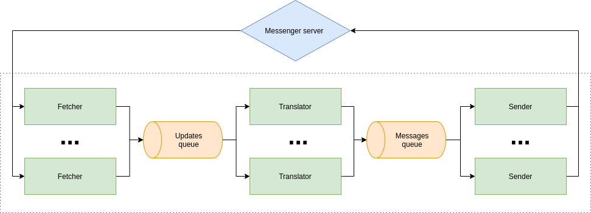

# Echo-bot

This repository contains simple polymorphic echo bot for VK and Telegram.

This application build on top of [req](https://hackage.haskell.org/package/req) to proceed request to messengers servers and uses [Tagless Final](http://okmij.org/ftp/tagless-final/index.html) approach to abstract business logic over concrete implementation.

*NOTE*: The application was created for education purpose.

### Prerequisites

This project relies on the [Haskell Stack tool](https://docs.haskellstack.org/en/stable/README/).

## Config

This applications uses external config file called `bot.config` to set up its behavour.

The sample config is placed into root directory of this repository.

*NOTE*: The `log_level` can be either `debug`, `info`, `warning` or `error`. 
Delays are specified in miliseconds.

## Build

To build this project simply run

```sh
stack build
```

This will install all dependencies, including a proper version of GHC.

## Run

This project has one executable that you can run with

``` sh
stack exec echo-bot-exe
```

## Test

Tests of this project relies on [Tasty](https://hackage.haskell.org/package/tasty)
framework with [HUnit](https://hackage.haskell.org/package/HUnit) 
and [Hedgehog](https://hackage.haskell.org/package/hedgehog) addons for unit tests 
and property-based ones.

To run tests simply run

```sh
stack test
```

## Project structure overview

The main logic of whole application is placed into `src` folder (default for stack).
Here you can examine file structure of this folder:

``` sh
.
├── Bot
│   ├── Shared
│   │   └── RepeatCommandHandler.hs
│   ├── Shared.hs
│   ├── Telegram
│   │   ├── Fetcher.hs
│   │   ├── Sender.hs
│   │   ├── Translator.hs
│   │   └── Types
│   │       ├── Config.hs
│   │       ├── Msg.hs
│   │       ├── Shared.hs
│   │       └── Updates.hs
│   ├── Telegram.hs
│   ├── VK
│   │   ├── Fetcher
│   │   │   └── LongPollServer.hs
│   │   ├── Fetcher.hs
│   │   ├── Sender
│   │   │   ├── Keyboard.hs
│   │   │   └── Keyboard.json
│   │   ├── Sender.hs
│   │   ├── Translator.hs
│   │   └── Types
│   │       ├── Config.hs
│   │       ├── Msg.hs
│   │       ├── Shared.hs
│   │       └── Updates.hs
│   └── VK.hs
├── Bot.hs
├── Config.hs
├── Helpers.hs
├── Logger.hs
└── Logic.hs
```

### Business logic

All business logic is placed into `Logic.hs` file. Business logic are expressed in
tagless final style. It separated into three parts:

+ **Fetcher** - fetches updates from messanger server and push them into queue. 
+ **Translator** - pulls updates from the queue, transform them into messages ready to send (it is also handles repetitions) and then push them to the second queue.
+ **Sender** - simply pulls messages from queue and send them to messanger server.

Here you can see diagram of business logic structure:


An advantages of this separted business logic into different small parts is ability
to run each of them in separate thread (their connection is provided via `STM Queue`).

This architecture provides an ability of not linear system scaling:


